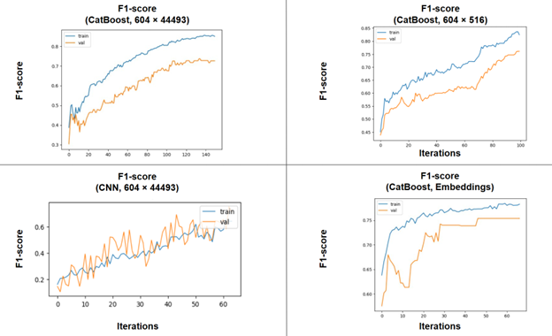

# **Solving classification tasks on embedded presentation of genomic data**

## Aim and objectives
**Aim**: predict corn phenotype (heterotic group) using genotype data and compare the effectiveness of phenotype prediction methods.

**Objectives**:
1) make a baseline predictions using CatBoost on the full dataset;
2) make predictions using convolutional neural networks;
3) make predictions using CatBoost after feature selection based on importance with Z-score filtering
4) make predictions using an embedded dataset;
5) compare prediction results and draw conclusions about the preferred strategy.

## **Results**

Graph with F1-score dynamics on training and validation sets during training:

Received metrics:

<table>
  <tr>
    <th rowspan="2">Metric</th>
    <th colspan="2">CatBoost (604×44493)</th>
    <th colspan="2">CNN (604×44493)</th>
    <th colspan="2">CatBoost (embedded)</th>
    <th colspan="2">CatBoost (604×516)</th>
  </tr>
  <tr>
    <th>Train</th>
    <th>Test</th>
    <th>Train</th>
    <th>Test</th>
    <th>Train</th>
    <th>Test</th>
    <th>Train</th>
    <th>Test</th>
  </tr>
  <tr>
    <td>Accuracy</td>
    <td>0.88</td>
    <td>0.80</td>
    <td>0.78</td>
    <td>0.75</td>
    <td>0.80</td>
    <td>0.76</td>
    <td>0.85</td>
    <td>0.79</td>
  </tr>
  <tr>
    <td>F1-score</td>
    <td>0.85</td>
    <td>0.77</td>
    <td>0.78</td>
    <td>0.74</td>
    <td>0.77</td>
    <td>0.68</td>
    <td>0.82</td>
    <td>0.76</td>
  </tr>
  <tr>
    <td>ROC AUC</td>
    <td>0.99</td>
    <td>0.94</td>
    <td>0.96</td>
    <td>0.95</td>
    <td>0.97</td>
    <td>0.93</td>
    <td>0.99</td>
    <td>0.97</td>
  </tr>
  <tr>
    <td>RAM (GB)</td>
    <td colspan="2">107.72</td>
    <td colspan="2">6.89</td>
    <td colspan="2">0.02</td>
    <td colspan="2">0.41</td>
  </tr>
  <tr>
    <td>Time (min)</td>
    <td colspan="2">171.53</td>
    <td colspan="2">33.43</td>
    <td colspan="2">0.03</td>
    <td colspan="2">0.61</td>
  </tr>
</table>

## Conclusions
CatBoost on the full dataset shows one of the best classification quality in training and requires quite big amount of RAM. However, high performance on a train set may indicate some overtraining.
CatBoost on the embedded dataset received after using Autoencoder showed F1-score lower than other models and likely has a tendency for overfitting.
The using of CNN a full dataset and CatBoost on a dataset received with feature importance showed the least overfitting results with saving low computational costs and acceptable level of accuracy.

## References

1. A. V. Dorogush, A. Gulin, G. Gusev, N. Kazeev, L. O. Prokhorenkova, and A. Vorobev, "Fighting biases with dynamic boosting," arXiv preprint arXiv:1706.09516, 2017. Available: https://arxiv.org/abs/1706.09516
2. T. Islam, M. M. Rahman, and M. S. Ali, "ConvCGP: A convolutional neural network to predict genotypic values of rice traits from compressed genome-wide polymorphisms," bioRxiv, 2024. Available: https://doi.org/10.1101/2024.11.20.624609
3. C. Li, H. Guan, X. Jing et al., "Genomic insights into historical improvement of heterotic groups during modern hybrid maize breeding," Nature Plants, vol. 8, no. 6, pp. 750–763, 2022. Available: https://doi.org/10.1038/s41477-022-01190-2
  
4. A. Mahato, R. Kumar, and V. Sharma, "Heterotic grouping of sweet corn (Zea mays var. saccharata) genotypes based on their combining ability and molecular diversity," Indian Journal of Genetics and Plant Breeding, vol. 81, no. 3, pp. 410–421, 2021. Available: https://doi.org/10.31742/IJGPB.81.3.8
5. A. Paszke, S. Gross, S. Chintala et al., "Automatic differentiation in PyTorch," in NIPS 2017 Workshop on Autodiff, 2017. Available: https://openreview.net/forum?id=BJJsrmfCZ

